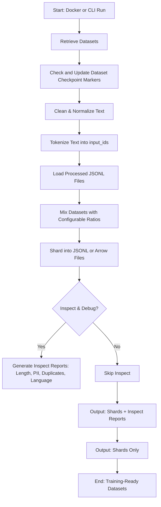

# Mainpipe Dataset Pipeline — Design Report

## 1. Overview
The **Mainpipe pipeline** is an end-to-end data preparation system designed to:

1. **Retrieve datasets** (PubMed Abstracts, Wikipedia, GitHub code, C4 web text).  
2. **Preprocess** text (cleaning, normalization, tokenization).  
3. **Mix datasets** according to configurable ratios.  
4. **Shard datasets** into training-ready JSONL or Arrow files.  
5. **Enable inspectability and debugging** through metrics and sample reports.  
6. **Run fully inside Docker** for reproducibility.  
7. **Be configurable via YAML** for easy environment adjustments.

---

## 2. Architecture

### Core Components

- **`RetrieveDatasets` (`utils/download_dataset.py`)**  
  - Handles dataset download and filtering.  
  - `_save_subset`: streams from HuggingFace Hub, filters, size-limits, saves as `.jsonl`.  
  - `download_datasets`: orchestrates downloads for PubMed, Wikipedia, C4, and optionally GitHub.  

- **`DataParser` (`utils/data_parser.py`)**  
  - Handles **text-level processing**:  
    - `clean_text`: removes noise, lowercases, removes unwanted characters.  
    - `normalize_text`: deduplicates punctuation, normalizes numbers.  
    - `tokenize_text`: converts text into `input_ids` using HuggingFace tokenizer.  
  - Default tokenizer: `bert-base-uncased` (configurable).

- **`DatasetPreper` (`utils/data_prep.py`)**  
  - Handles **dataset-level processing**:  
    - Load processed JSONL files.  
    - Mix datasets with ratios.  
    - Shard into `.jsonl` or `.arrow`.  
    - Run **debug sampling** or **inspectability checks** (histograms, PII detection, duplicates).

- **`DatasetCheckpoint` (`utils/dataset_monitor.py`)**  
  - Handles **dataset checkpoint to prevent reprocessing the same dataset**:  
    - Load previous checkpoint markers for each dataset
    - "Update" checkpoints after successfully downloading them
        - Update is limited due to it running on a container.

- **`main.py`**  
  - Orchestration layer:  
    - Downloads datasets via `RetrieveDatasets`.  
    - Check and update dataset checkpoint markers datasets via `DatasetCheckpoint`.  
    - Cleans/normalizes/tokenizes via `DataParser`.  
    - Loads/mixes/shards via `DatasetPreper`.  
    - Produces debug and inspect outputs if enabled.  

---
** Pipeline Flow Diagram **


## 3. Configuration

All pipeline parameters are centralized in `config/mainpipe_nonprod.yaml`.  

```yaml
# Input / Output Control
paths:
  input_dir: "data"
  processed_dir: "processed"
  shards_dir: "processed_shards"
  inspect_dir: "inspect_reports"

datasets:
  - pubmed.jsonl
  - wikipedia.jsonl
  - c4_en.jsonl
  # - github.jsonl

# Preprocessing Settings
preprocessing:
  lowercase: true
  remove_punct: true
  normalize_numbers: true
  max_length: 512
  tokenizer_model: "bert-base-uncased"

# Mixing Settings
mixing:
  ratios:
    pubmed: 0.4
    wikipedia: 0.3
    c4: 0.3
    # github: 0.3
  shuffle_seed: 42

# Sharding Settings
sharding:
  shard_size: 2000
  as_arrow: false
  prefix: "shard"
  compression: null # options: null, "gz"

# Inspectability / Debug
debug:
  enabled: true
  inspect_samples: 5
  verbose: true

inspect:
  enabled: true
  output_dir: "inspect_reports"
  detect_language: true
  check_duplicates: true
  check_pii: true

# Performance / Runtime
runtime:
  streaming: false
  num_workers: 1
  batch_size: 16

```
---

## 4. How to run (Docker + CLI)

**Build image (no downloads at build-time)**
Make sure Dockerfile does not run the heavy pipeline during build.

```bash
# build image
docker compose build

```

Run pipeline (recommended — runs inside container, writes to host via volumes)

Mount host folders so outputs persist on host:

```bash
> cd container/scripts
> docker run --rm \
  -v $(pwd)/config:/usr/scripts/config \
  -v $(pwd)/data:/usr/scripts/data \
  -v $(pwd)/processed:/usr/scripts/processed \
  -v $(pwd)/processed_shards:/usr/scripts/processed_shards \
  -v $(pwd)/inspect_reports:/usr/scripts/inspect_reports \
  container-mainpipe \
  python main.py
```
---

### 5. Outputs (files & folders)

	-	data/ — raw downloaded JSONL files:
	    - pubmed.jsonl (~50MB target)
	    - wikipedia.jsonl (~20MB target)
	    - c4_en.jsonl (~50MB target)
	    - github.jsonl (Not working, at the moment)

    - processed/ — intermediate *_processed.jsonl containing:
	    - "text" (cleaned + normalized)
	    - "input_ids" (token IDs)

    - processed_shards/ — final training shards:
	    - shard_000.jsonl, shard_001.jsonl, …
	    - optionally Arrow folders shard_000_arrow/ if as_arrow: true
    
    - inspect_reports/ — inspectability outputs:
	    - inspect_report.json (summary statistics)
	    - length_hist.png (histogram)
	    - other artifacts (optionally per-shard stats)
---

### 6. Testing, Validation & Inspectability

**Debug / Inspect**

	-	Debug (fast): sample previews (first n processed samples). Controlled by debug.enabled and inspect_samples.
	-	Inspect (deeper): corpus-level metrics such as:
	-	Token/char length histogram.
	-	Language distribution (sampled, langdetect).
	-	Duplicate detection via hashing.
	-	PII hit counts (email/phone regex heuristics).

---

### Unfinished tasks

	-   GitHub subset: streaming+filtering The Pile is slow. Options:
	    - Maybe could use a pre-split code dataset (e.g., bigcode/the-stack, codeparrot/github-code).
	-   Tokenizer choice: bert-base-uncased is a general-purpose tokenizer (good baseline). For domain-specific tasks (biomedical, code) use specialized tokenizers (PubMedBERT, CodeBERT) or other model specific tokenizers.
    - Improve performance of the DataParser class by adding more streaming flag (reduce memory load), increase worker count and batch sizes 
        - Currently only added in the config under **Performance/Runtime** options
    - Add flexiblity to save other output formats. Currently only support arrow.
    - Improve incremental runs due to data checkpoint parsing.